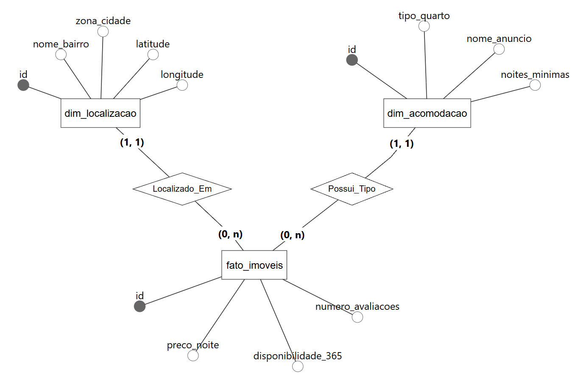
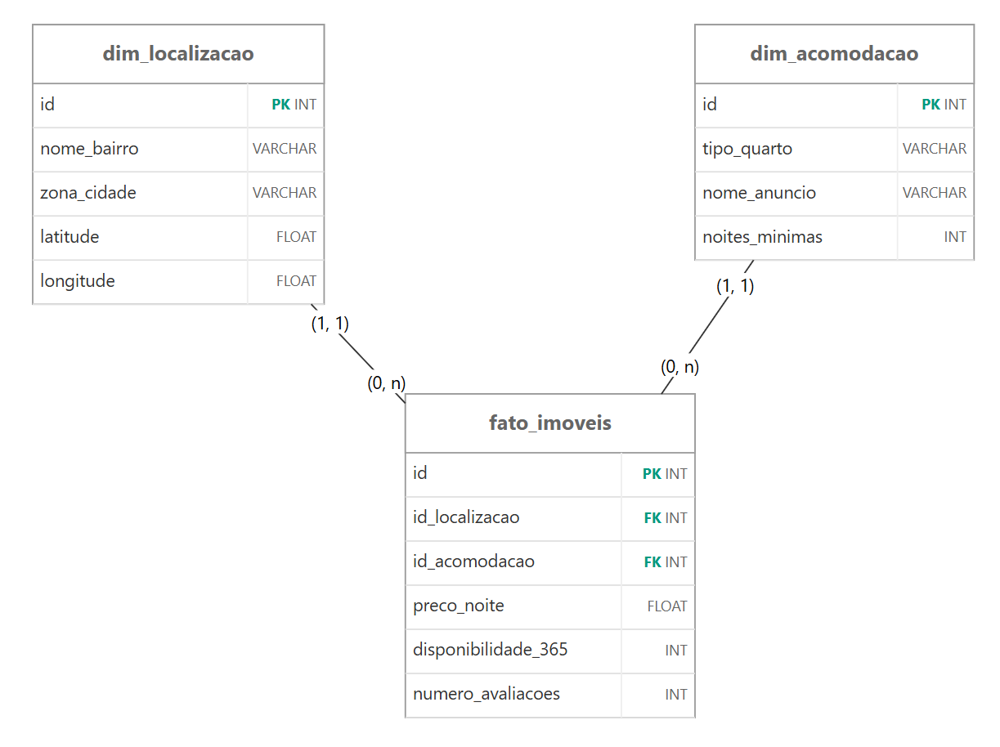

# 📊 Data Warehouse & Análise de Precificação de Imóveis de Temporada


Projeto de Modelagem de Data Warehouse e Análise Exploratória de Dados (AED) desenvolvido para o Módulo 1 do curso de Análise de Dados da Digital College.

---

## 🎯 Problema de Negócio

> **"Quais bairros geram mais receita potencial e como definir preços competitivos?"**

O objetivo principal consiste em identificar padrões de preços, avaliar a relação de oferta e demanda e pontuar oportunidades financeiras em listagens de aluguel por temporada através de queries em PostgreSQL.

---

## 🛠️ Arquitetura do Data Warehouse

A modelagem dimensional foi construída no software **brModelo** e implementada fisicamente no banco **PostgreSQL** via **pgAdmin4**.

### Modelo Conceitual


### Modelo Lógico


> 📄 Os esquemas originais em vetor estão disponíveis na pasta [`docs/`](./docs/).

---

## 🔎 Perguntas de Negócio & Insights (AED)

As consultas SQL desenvolvidas para responder às diretrizes do projeto cobrem cinco eixos estratégicos:

### 1. Bairros com imóveis mais caros
Mapeamento dos tetos tarifários (preço máximo por diária) praticados em cada região.

```sql
SELECT
	dl.nome_bairro,
	ROUND(MAX(fi.preco_noite), 2) AS preco_maximo
FROM fato_imoveis fi
JOIN dim_localizacao dl ON fi.fk_localizacao = dl.id
JOIN dim_acomodacao da ON fi.fk_acomodacao = da.id
GROUP BY dl.nome_bairro
ORDER BY preco_maximo DESC;
```

### 2. Preço médio por tipo de acomodação
Análise comparativa por categoria de quarto (tipo_quarto), tratando valores zerados via NULLIF para evitar distorções no cálculo da diária média real.

### 3. Relação entre disponibilidade e preço
Análise realizada em duas etapas: segregação por faixas de oferta/demanda com cálculo de ocupação estimada e validação estatística com o Coeficiente de Correlação de Pearson (CORR).

### 4. Bairros com maior potencial de faturamento anual
Projeção de receita bruta por bairro comparando a receita potencial realizada (baseada na taxa de ocupação estimada 365 - disponibilidade_365) contra o faturamento teto teórico (100% de ocupação anual).

### 5. Imóveis subvalorizados ou supervalorizados
Uso de Common Table Expression (CTE) e Window Function (AVG OVER PARTITION BY) para comparar a diária de cada anúncio contra a média do seu próprio bairro e tipo de acomodação. Imóveis com desvio superior a +100% (2x a média) são classificados como Supervalorizados, e com desvio inferior a -50% (metade da média) como Subvalorizados.

---

## 📂 Estrutura do Repositório

```text
├── assets/         # Imagens dos modelos e artes dos slides
├── docs/           # Modelagens originais em PDF e Apresentação do Projeto
└── sql/            # DDL, DML e Scripts de Análise Exploratória
```

---

## 💻 Materiais da Apresentação

* 📑 **Apresentação em Slides:** [`docs/Apresentacao_Modulo_1.pdf`](./docs/apresentacao_slides.pdf)
* 📜 **Scripts SQL do Projeto:** [`sql/`](./sql/)
